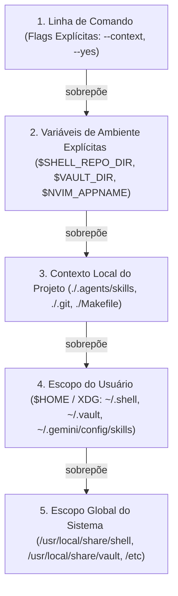
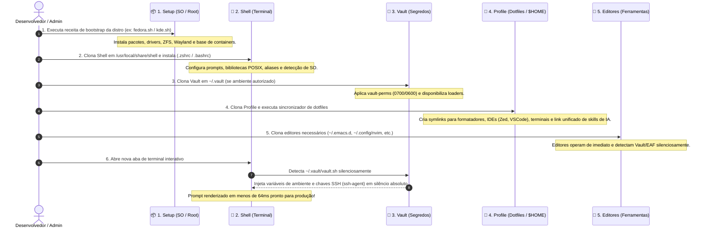

# 🏛️ O Quarteto de Produtividade (Universal Environment Architecture)

> Manifesto unificado de arquitetura, governança e contratos de responsabilidade do ecossistema de produtividade pessoal de Gabriel Frigo.

---

## 🧭 Visão Geral & Filosofia

O ecossistema foi concebido para resolver de forma definitiva o atrito entre sistemas operacionais heterogêneos (**Linux**, **FreeBSD**, **Windows**), garantindo que qualquer estação de trabalho possa ser provisionada, personalizada e operada em minutos com **simetria perfeita**, **desempenho instantâneo** e **segurança rigorosa**.

Em vez de um monólito caótico de dotfiles e scripts soltos, o ambiente é estruturado como uma federação de **4 repositórios complementares e desacoplados** — **O Quarteto de Produtividade** — acompanhados de uma **Suíte de Editores** autônomos:

```mermaid
flowchart TD
    subgraph QUARTET ["🏛️ O Quarteto de Infraestrutura"]
        SETUP["📦 1. Setup (Público)<br/>• Provisionamento Ativo de SO<br/>• Pacotes de Sistema, Drivers, Kernel<br/>• Jails, Containers (Incus/Podman)<br/>• Cookbook Zero-Clone (GitHub)"]
        SHELL["🐚 2. Shell (Público)<br/>• Motor Interativo de Terminal<br/>• Prompts Ultra-rápidos (&lt; 64ms)<br/>• Aliases e Funções de Linha de Comando<br/>• Targets de SO e Contextos"]
        VAULT["🔐 3. Vault (Privado)<br/>• Chaves SSH / PuTTY PPK<br/>• Segredos e Variáveis .env<br/>• Senhas Wi-Fi e Mapeamento de Hosts<br/>• Loaders Multi-Shell (sh, ps1, cmd, nu)"]
        PROFILE["🎨 4. Profile (Público)<br/>• Dotfiles Declarativos de Usuário<br/>• IDEs Modernas & Perfis de Terminal<br/>• Linters, Formatadores e Skills de IA"]
    end

    subgraph EDITORS ["📝 A Suíte de Editores (Autônomos & Reentrantes)"]
        EMACS["🔮 Emacs (emacs)<br/>• Elisp, Org-mode, Elpaca<br/>• EAF, IA e Autodetecção Oportunística"]
        HELIX["🧬 Helix (helix)<br/>• Rust, Modal Pós-Moderno<br/>• Tree-sitter & LSP Nativo"]
        NVIM["⚡ NeoVim (neovim)<br/>• Lua, Lazy, Mason, LSP<br/>• Kanagawa & FHS Modular"]
        VIM["📜 Vim (vim)<br/>• Vimscript, Vim-Plug<br/>• CodeDark & Onipresença UNIX"]
    end

    subgraph HOST ["💻 Sistema Operacional Host (Clean Host)"]
        KERN["⚙️ Kernel, Drivers & Rede"]
        GUI["🖥️ Desktop Wayland (GNOME / KDE)"]
        CLI["📟 Sessão Interativa de Terminal"]
        APPS["📝 IDEs, Editores & Ferramentas"]
    end

    SETUP -->|1. provisiona com privilégios| KERN
    SETUP -->|1. instala pacotes e base| GUI
    SHELL -->|2. energiza a sessão do terminal| CLI
    VAULT -->|3. injeta credenciais em silêncio| SHELL
    VAULT -->|3. provê chaves para ssh-agent| APPS
    VAULT -.->|tokens e chaves de IA| EMACS
    PROFILE -->|4. sincroniza dotfiles ($HOME)| APPS
    PROFILE -->|4. provê inteligência e skills| CLI
    EDITORS -->|editores residentes autônomos| APPS
```

---

## 🏛️ O Paradigma da Autonomia Reentrante & Sinergia Oportunística

O ecossistema adota dois axiomas fundamentais que governam a engenharia de todos os repositórios: **autonomia reentrante** e **precedência local sobre global**.

### 1. Dois Modos de Uso como Cidadãos de Primeira Classe

1. **A Realidade Descentralizada de Produção (Zero-Coupling / Standalone First):**
    - Em máquinas de produção, servidores remotos, contêineres e estações finais, **o repositório Environment NÃO é utilizado diretamente como runtime**.
    - Cada ferramenta vive e opera diretamente em seu caminho canônico XDG/Unix no sistema operacional:
        - **Shell:** `/usr/local/share/shell` (ou `~/.local/share/shell` em modo rootless)
        - **Profile:** `~/.config/profile` (de onde dispara a sincronização de dotfiles e skills)
        - **Vault:** `~/.vault` (ou `%USERPROFILE%\.vault`)
        - **GNU Emacs:** `~/.emacs.d`
        - **Helix:** `~/.config/helix`
        - **NeoVim:** `~/.config/nvim`
        - **Vim:** `~/.vim` (ou `~/vimfiles` no Windows)
    - **Zero Dependências Obrigatórias:** Nenhum repositório exige que outro esteja presente para funcionar com perfeição.
    - **Zero Ruído:** Não há mensagens de erro, alertas de "módulo ausente" ou avisos se os outros repositórios não existirem. A experiência isolada é cidadã de primeira classe.
2. **O Papel do Environment (Bancada de Desenvolvimento & Hub do Arquiteto):**
    - O **Environment** (`~/Documents/Environment`) é **estritamente uma bancada de desenvolvimento e orquestração**. Ele **NÃO** deve ser referenciado diretamente por inicializadores de shell (`.bashrc`, `.zshrc`) ou dotfiles.
    - Ele centraliza os submódulos para que o desenvolvedor/arquiteto possa inspecionar e evoluir todo o ecossistema de forma unificada.
    - Serve para executar suítes globais de testes (`make test`), auditorias estáticas cruzadas (`make audit`), validação de formatação (`make lint-md`), normalização de banners (`make fix-banners`) e propagação da documentação canônica (`make sync-docs`).
    - O comando `make install` (ou `./environment.sh install`) é o ponto de entrada canônico para provisionar a máquina: ele clona cada repositório em suas localizações canônicas de sistema e dispara a sincronização a partir do clone soberano do Profile (`~/.config/profile/profile.sh sync`), garantindo zero acoplamento com a pasta de desenvolvimento.

### 2. O Axioma da Precedência Local sobre Global (Local > Global)

Inspirado no princípio UNIX da localidade e na 18ª Regra da Soberania do Usuário, **o escopo mais específico, intencional e local sempre tem precedência absoluta sobre o escopo mais genérico e global**:



- **Resolução em Scripts e Loaders:**
    1. Variável explícita de ambiente (`$SHELL_REPO_DIR`, `$VAULT_DIR`).
    2. Diretório local do usuário no `$HOME` (`~/.shell`, `~/.local/share/shell`, `~/.vault`).
    3. Diretório global do sistema (`/usr/local/share/shell`, `/usr/local/share/vault`).
- **Resolução em Portable AI Skills & Agentes:**
    1. **Projeto Local (`<repo>/.agents/skills/`):** Máxima prioridade. Permite que um projeto defina runbooks e regras específicas que sobrescrevem qualquer padrão global sem poluir a máquina do usuário.
    2. **Usuário Global (`~/.gemini/config/skills/` via `Profile/skills/`):** Habilidades perenes da estação de trabalho, compartilhadas entre projetos.
    3. **Built-in da IDE (`builtin/skills`):** Habilidades nativas de fábrica como fallback de último nível.

### 3. Sinergia Oportunística e Degradação Graciosa

Quando os repositórios coexistem no mesmo sistema, eles **detectam-se automaticamente e ativam capacidades adicionais em silêncio absoluto**:

- **Emacs ↔ Vault / IA:** Se o Emacs detectar o Vault em `~/.vault` ou `/usr/local/share/vault` (ou credenciais em variáveis de ambiente), ativa automaticamente seus módulos de IA (`gptel`, `ellama`, `minuet`, `org-ai`). Se ausente, inicializa instantaneamente em modo limpo (< 50ms) sem erros.
- **Emacs ↔ EAF:** Se o Emacs estiver em modo gráfico com a pasta do EAF e `python3` disponíveis, ativa a integração. Caso contrário, opera normalmente em modo texto ou terminal sem falhas de D-Bus.
- **Shell ↔ Vault:** O Shell detecta silenciosamente o cofre e injeta chaves SSH e variáveis. Se o cofre não for encontrado, roda normalmente em modo anônimo.
- **Profile ↔ Skills de IA:** O Profile cria um link simbólico unificado de diretório (`~/.gemini/config/skills -> Profile/skills`). Qualquer nova skill adicionada ao repositório fica imediatamente disponível no IDE após um `git pull`, sem necessidade de novos links manuais.
- **Profile ↔ Editores de Texto:** O Profile **NÃO** gerencia nem cria links para editores de texto modais (`~/.emacs.d`, `~/.config/nvim`, etc.). Esses editores gerenciam-se a si mesmos em seus diretórios canônicos.

---

## 📋 Matriz de Papéis e Responsabilidades

### 🏛️ O Quarteto de Infraestrutura (Core)

| Repositório                                             | Visibilidade | Papel Central                                                                                                               | Escopo & Privilégios                                                 | Modelo de Instalação                                                                         | Local Canônico                           |
| :------------------------------------------------------ | :----------- | :-------------------------------------------------------------------------------------------------------------------------- | :------------------------------------------------------------------- | :------------------------------------------------------------------------------------------- | :--------------------------------------- |
| **[Setup](https://github.com/GabrielFrigo4/setup)**     | Público      | **1. O "COMO" (Sistema)**: Provisionamento de pacotes, drivers, containers, hypervisors e serviços base.                    | Nível SO / Privilegiado (`root` / `sudo` / `ELEVATE` / Admin)        | **Cookbook Efêmero (Zero-Clone)**: Execução direta via GitHub web ou `curl \| sh`.           | Efêmero / Não requer clone residente     |
| **[Shell](https://github.com/GabrielFrigo4/shell)**     | Público      | **2. A "INTERAÇÃO" (Linha de Comando)**: Prompts instantâneos, aliases, cascading de editores e funções POSIX.              | Nível Shell / Sessão (disponível para todos os usuários e `root`)    | **Residente do Sistema**: Clonado e atualizado via `git pull` contínuo.                      | `/usr/local/share/shell` ou `~/.shell`   |
| **[Vault](https://github.com/GabrielFrigo4/vault)**     | **Privado**  | **3. O "SEGREDO" (Cofre Criptográfico)**: Chaves SSH/PuTTY, tokens de API, credenciais Wi-Fi e endpoints de hosts.          | Usuário Restrito (Permissões estritas `0700` e `0600`, zero-leakage) | **Residente Privado**: Clonado exclusivamente em máquinas autorizadas.                       | `${HOME}/.vault`                         |
| **[Profile](https://github.com/GabrielFrigo4/profile)** | Público      | **4. O "O QUÊ" (Identidade)**: Dotfiles declarativos, editores, terminais, linters, links de sync e skills portáteis de IA. | Nível Usuário (`$HOME`, zero privilégios administrativos)            | **Residente Sincronizado**: Cloned no `$HOME`, sincronizado via links simbólicos (`ln -sf`). | `~/.config/profile` ou `~/.profile-repo` |

### 📝 A Suíte de Editores (Tools)

| Repositório                                           | Visibilidade | Papel Central                                                                                                  | Linguagem & Motor       | Modelo de Operação / Instalação                          | Local Canônico            |
| :---------------------------------------------------- | :----------- | :------------------------------------------------------------------------------------------------------------- | :---------------------- | :------------------------------------------------------- | :------------------------ |
| **[Emacs](https://github.com/GabrielFrigo4/emacs)**   | Público      | **Ambiente Extensível Lisp**: Org-mode, Elpaca package manager, EAF, árvore sintática e IA.                    | Emacs Lisp (Elisp)      | Autônomo reentrante com autodetecção de EAF e Vault      | `~/.emacs.d`              |
| **[Helix](https://github.com/GabrielFrigo4/helix)**   | Público      | **Editor Modal Pós-Moderno**: Mapeamentos ergonômicos, seleção múltipla nativa, Tree-sitter e zero-plugin LSP. | TOML declarativo / Rust | Autônomo reentrante puro e zero-dependência              | `~/.config/helix`         |
| **[NeoVim](https://github.com/GabrielFrigo4/neovim)** | Público      | **Editor Modal Moderno**: Arquitetura modular FHS em Lua, Lazy.nvim, Mason LSP, Telescope e tema Kanagawa.     | Lua / Neovim runtime    | Autônomo reentrante com autoinstalação Lazy.nvim         | `~/.config/nvim`          |
| **[Vim](https://github.com/GabrielFrigo4/vim)**       | Público      | **Editor Clássico Resiliente**: Onipresença UNIX, Vim-Plug, syntax highlighting, CodeDark e fallback seguro.   | Vimscript puro          | Autônomo reentrante com fallback nativo sem dependências | `~/vimfiles` e `~/.vimrc` |

---

## 🔄 Fluxo Canônico de Boot da Máquina (5 Etapas)

Ao inicializar uma nova máquina física, máquina virtual ou ambiente limpo, o ciclo de vida segue uma sequência estrita:



---

## ⚡ Comandos Canônicos de Ciclo de Vida & Atualização

Cada módulo possui seu próprio utilitário de atualização individual, garantindo total desacoplamento:

| Comando   | Alias                | Repositório Alvo          | Escopo & Comportamento                                                                                             |
| :-------- | :------------------- | :------------------------ | :----------------------------------------------------------------------------------------------------------------- |
| `upsh`    | `update-shell`       | **Shell**                 | Atualiza o repositório ativo (`$SHELL_REPO_DIR`, `~/.shell` local ou `/usr/local/share/shell` global) e recarrega. |
| `upvt`    | `update-vault`       | **Vault**                 | Atualiza o cofre (`$VAULT_DIR`, `~/.vault` local ou `/usr/local/share/vault` global) e recarrega chaves SSH.       |
| `uped`    | `update-editors`     | **Editores**              | Inspeciona e atualiza individualmente `~/.emacs.d`, `~/.config/nvim`, `~/.config/helix`, `~/vimfiles`.             |
| `upmodes` | `update-emacs-modes` | **Modos Elisp**           | Sincroniza diretamente os submódulos Elisp locais (`~/.emacs.d/usr/local/*`) com os branches upstream remotos.     |
| `uprc`    | `update-profile`     | **Profile**               | Atualiza `~/.config/profile` e reaplica links de dotfiles e skills de IA.                                          |
| `upgit`   | `update-git`         | **Todos Git**             | Busca e atualiza recursivamente todos os repositórios Git no diretório corrente.                                   |
| `upall`   | `update-all`         | **Sistema + Ecossistema** | Atualiza pacotes do SO (`dnf`, `apt`, `pkg`, `aur`) e, oportunisticamente, os módulos instalados.                  |

---

## 🏛️ Invariantes & Padrões Universais de Engenharia

Todos os repositórios do ecossistema aderem rigorosamente aos mesmos padrões arquiteturais de Clean Code e governança:

### 1. Os 19 Princípios de Engenharia

Baseados nos 17 Princípios UNIX (_The Art of UNIX Programming_, Eric S. Raymond, 2003) somados aos 2 Princípios fundamentais do ecossistema:

- **18. A Regra da Soberania do Usuário (_Rule of User Sovereignty_):** Nenhuma automação, script ou loader deve sobrescrever variáveis ou configurações pré-existentes do usuário sem consentimento explícito. Ferramentas intencionais do usuário (`doas`, `paru`, `hx`, `eza`, `rg`, `bat`) têm prioridade sobre utilitários genéricos.
- **19. A Regra da Autonomia Reentrante (_Rule of Reentrant Autonomy & Opportunistic Synergy_):** Todo repositório deve operar com total independência, sem dependências obrigatórias e sem ruído de erro quando isolado. Quando outros componentes são detectados, sinergias são ativadas em silêncio e de forma imediata.

### 2. Arquitetura de Comentários em Três Camadas (Regra do Não-Vazamento)

- **Zero Comentários Narrativos:** Comentários explicativos inline ("faz isso", "verifica aquilo") são expressamente proibidos em código, scripts, templates e exemplos de documentação. O código expressa sua intenção por meio de nomes semânticos e separação por linhas em branco.
- **Camada 1 — Header Banner (64 `-`):** Exclusivo para o topo do arquivo (linhas 2 a 4), delimitando a identidade do script:
    ```sh
    # ----------------------------------------------------------------
    # Recipe: [Nome do Software / Funcionalidade]
    # ----------------------------------------------------------------
    ```
- **Camada 2 — Delimitadores de Corpo (32 caracteres):**
    - **Seções Principais (32 `=`):**
        ```sh
        ### ================================
        ### NOME DA SECAO PRINCIPAL
        ### ================================
        ```
    - **Subseções (32 `-`):**
        ```sh
        ### --------------------------------
        ### Nome da Subsecao
        ### --------------------------------
        ```
    - **Regra do Não-Vazamento:** O texto do título DEVE ter no máximo 32 caracteres (total de 36 colunas com `### `) e JAMAIS vazar além da régua divisora. Títulos concisos, sem parênteses e sem numerações redundantes.

### 3. Padrão Universal de Documentação (README Templates)

- **README Raiz:** Portal institucional com título e emoji, blockquote de missão, badges do Quarteto de Produtividade, tecnologias suportadas, catálogo de primeiro nível e comandos de auditoria/CI.
- **README de Subpastas:** Catálogo tabular padronizado (`| Arquivo / Receita | Descrição | Plataforma |`) e bloco de execução limpo sem comentários inline.

### 4. Taxonomia Estrita de Nomenclatura

- **`kebab-case` público:** Comandos, aliases e funções destinados à invocação interativa (`vault-keys`, `vault-perms`, `update-all`, `open-helix`).
- **`_snake_case` privado:** Funções internas de infraestrutura, bootstrapping e variáveis locais temporárias (`_as_root`, `_detect_os`, `_vault_dir`).
- **`SNAKE_CASE` maiúsculo:** Variáveis globais de ambiente e constantes (`PATH`, `SHELL_REPO_DIR`, `VAULT_DIR`).

### 5. Permissões Canônicas em 4 Dígitos Octais

- `chmod 0755`: Diretórios e scripts executáveis públicos (`Setup`, `Profile`, `Shell`, `Editor/*`).
- `chmod 0644`: Dotfiles estáticos, documentações e arquivos de configuração públicos.
- `chmod 0700`: Diretórios privados e scripts executáveis com dados sensíveis (`Vault`).
- `chmod 0600`: Chaves privadas SSH, PuTTY PPK, tokens e arquivos `.env` (`Vault`).
- `chmod 0440`: Arquivos de autorização do sistema operacional (`/etc/sudoers.d/*`, `doas.conf`).

### 6. Governança Autônoma com IA e Quality Gates

- Todo repositório do ecossistema possui:
    - `.githooks/pre-commit` executável e atômico para validar integridade, sintaxe e formatação antes do commit.
    - `.agents/rules/principles.md` com diretrizes de engenharia específicas do seu domínio.
    - `.agents/skills/` com runbooks cognitivos padronizados (`universal-*`, `proactive-guardian`, `deep-investigation`).

---

## 🔗 Links dos Repositórios Federados

### 🏛️ O Quarteto de Infraestrutura

- 📦 **[Setup (Provisionamento de Sistema)](https://github.com/GabrielFrigo4/setup)**
- 🐚 **[Shell (Motor Interativo de Terminal)](https://github.com/GabrielFrigo4/shell)**
- 🔐 **[Vault (Cofre Criptográfico & Segredos)](https://github.com/GabrielFrigo4/vault)**
- 🎨 **[Profile (Dotfiles, Editores & IA)](https://github.com/GabrielFrigo4/profile)**

### 📝 A Suíte de Editores

- 🔮 **[Emacs (emacs)](https://github.com/GabrielFrigo4/emacs)**
- 🧬 **[Helix (helix)](https://github.com/GabrielFrigo4/helix)**
- ⚡ **[NeoVim (neovim)](https://github.com/GabrielFrigo4/neovim)**
- 📜 **[Vim (vim)](https://github.com/GabrielFrigo4/vim)**
